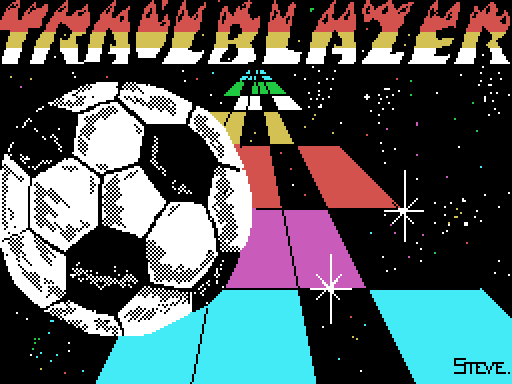
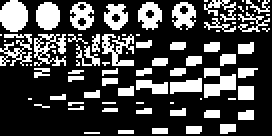

# The game

*The loading screen, drawn from the bytes of the tape. Bottom right, in small
type, the only signature in the whole game: **STEVE.***

A ball rolling down a track in perspective, strewn with holes, with stretches
that speed you up, stretches that slow you down and tiles that bounce you. There
are **fourteen tracks** and a clock, and that is the whole game.

## How you play

The keys are given by the game itself, in the scroller on the title screen:
**Q** left, **W** right, **P** speed up, **L** slow down and **space** to jump.
A Kempston stick works too, and the options screen picks between the two.

There are two games:

- **PLAY ARCADE**, the fourteen tracks one after another, with seven lives and
  four jumps. The clock **counts up**.
- **3 COURSE TEST**, three tracks chosen with A, B and C. Here the clock
  **counts down**: it is a race against time.

That is what the twin routines at `0x9284` and `0x92A7` say: the first takes the
clock down digit by digit and the second adds to it.

## The tiles

*The distinct rows in the table, the first 176 of them.*

The engine understands eight kinds of tile, and no more. That is what the
dispatcher at `0x8E65` says, comparing the tile against these values and no
others:

| value | what it is | what it does |
|---:|---|---|
| 0 | hole | the ball falls through |
| 1 and 5 | track | nothing; they are the two colours of the check |
| 2 | speed up | pushes speed to 6 |
| 6 | slow down | drops it to 2 |
| 7 | bounce | starts one of the seven jump curves |
| 3 and 4 | controls reversed | left and right swap |

The last two are the dirtiest: `0x8E21` flips the two joystick bits by
**rotating them over one another**, and from then on left is right.

## The ground, and when you fall

The ball does not fall for being over a hole: it falls **if both sides are open
air**. `0x8E94` reads the colour of three tiles out of VRAM — not out of the
map, out of what is painted — and checks whether there is ground to the left and
to the right. With both, nothing happens; with only one, the ball **slides seven
pixels** towards the side that does have ground; with neither, it falls.

## The jump

*The sprite patterns: the ball, in the sizes the perspective needs.*

There are **seven jump curves**, of 52, 40, 30, 23, 21, 18 and 13 values. Each
is the sprite's row frame by frame: it drops to a minimum and comes back up
symmetrically, closing with `0xFF`.

The table at `0x87E8` has **eight** entries and **repeats the longest in its
last three**, so of the eight possible bounces only six curves ever come out.
And there is a seventh, at `0x8722`, that this table does not point at: it is
reached another way, by jumping with the space bar.

## The sound

Three voices, each with its own interpreter. The background one is driven by
`0x8294`, which runs two voices at once using both of the Z80's register sets;
the effects go through `0x81B9` and `0x8258`, one per channel.

Notes are stored as indices into the period table at `0x812D`, which is **a
genuine chromatic scale**: twelve entries further on the period halves, which is
what defines an octave. The tests check it.

And the volume is not held in any variable: it is written **into the
instruction** that sets it (`0x81CF` writing at `0x81C6`).

## The tracks

They are drawn one by one in [The 14 tracks](THE-TRACKS.html).
