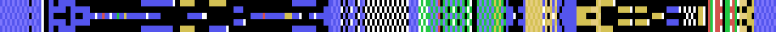
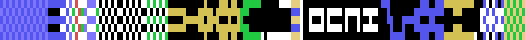

# Las 14 pistas

Aqui estan **las catorce pistas** del juego, dibujadas desde los bytes de la
cinta. Ni una captura.

Cada una va tumbada: **la salida a la izquierda y la meta a la derecha**, y de
arriba abajo las cinco casillas de ancho que tiene la pista. Los colores son
los ocho tipos de casilla que el motor entiende, y no una interpretacion: salen
del despachador de `0x8E65`, que compara la casilla contra esos valores y
contra ningun otro.

| color | que es | que hace |
|---|---|---|
| negro | agujero | la bola se cae |
| azul | pista | nada |
| verde | acelera | sube la velocidad a 6 |
| rojo | frena | la baja a 2 |
| blanco | rebota | arranca una de las curvas de salto |
| amarillo | mandos al reves | izquierda y derecha se cambian |

Y lo que hay guardado en la cinta **no son estas casillas**: son catorce listas
de indices a una tabla de filas. Como, esta contado en [El
codigo](EL-CODIGO.html).

Los nombres los da el propio juego, en la lista de `0xA4CB`. Y no es
casualidad que suenen a nombres de persona: **las pistas se llaman como quien
las hizo**.

## 1. EASY GOING

*219 filas. Lleva 265 agujeros, 75 casillas que aceleran, 8 que frenan, 58 que hacen rebotar y 0 que invierten los mandos.*

## 2. WOOLY JUMPER

*227 filas. Lleva 327 agujeros, 50 casillas que aceleran, 48 que frenan, 139 que hacen rebotar y 10 que invierten los mandos.*

## 3. TERRY'S TEST

*220 filas. Lleva 197 agujeros, 39 casillas que aceleran, 5 que frenan, 165 que hacen rebotar y 17 que invierten los mandos.*

## 4. PETE STREET

*279 filas. Lleva 521 agujeros, 39 casillas que aceleran, 7 que frenan, 56 que hacen rebotar y 20 que invierten los mandos.*

## 5. HACKERS EVIL HOLES

*326 filas. Lleva 636 agujeros, 5 casillas que aceleran, 10 que frenan, 78 que hacen rebotar y 195 que invierten los mandos.*

## 6. GREG THE NIPPER

*371 filas. Lleva 1140 agujeros, 10 casillas que aceleran, 6 que frenan, 232 que hacen rebotar y 0 que invierten los mandos.*

## 7. SHAUN NOT SEAN!!

*319 filas. Lleva 681 agujeros, 103 casillas que aceleran, 29 que frenan, 119 que hacen rebotar y 174 que invierten los mandos.*

## 8. JASON'S JUMPABOUT

*335 filas. Lleva 854 agujeros, 0 casillas que aceleran, 0 que frenan, 262 que hacen rebotar y 31 que invierten los mandos.*

## 9. MARK'S MOTOROLA

*335 filas. Lleva 506 agujeros, 5 casillas que aceleran, 0 que frenan, 454 que hacen rebotar y 43 que invierten los mandos.*

## 10. CHRIS'S CUL-DE-SAC

*155 filas. Lleva 449 agujeros, 0 casillas que aceleran, 0 que frenan, 46 que hacen rebotar y 59 que invierten los mandos.*

## 11. WELL I NEVER

*115 filas. Lleva 286 agujeros, 25 casillas que aceleran, 4 que frenan, 47 que hacen rebotar y 30 que invierten los mandos.*

## 12. SHRIGGLES'S SHRIGGLE

*175 filas. Lleva 342 agujeros, 54 casillas que aceleran, 5 que frenan, 172 que hacen rebotar y 116 que invierten los mandos.*

## 13. BOING BOING SPLAT!!

*175 filas. Lleva 538 agujeros, 9 casillas que aceleran, 13 que frenan, 73 que hacen rebotar y 50 que invierten los mandos.*

## 14. LAST BUT NOT LEAST!

*239 filas. Lleva 374 agujeros, 123 casillas que aceleran, 22 que frenan, 193 que hacen rebotar y 38 que invierten los mandos.*

